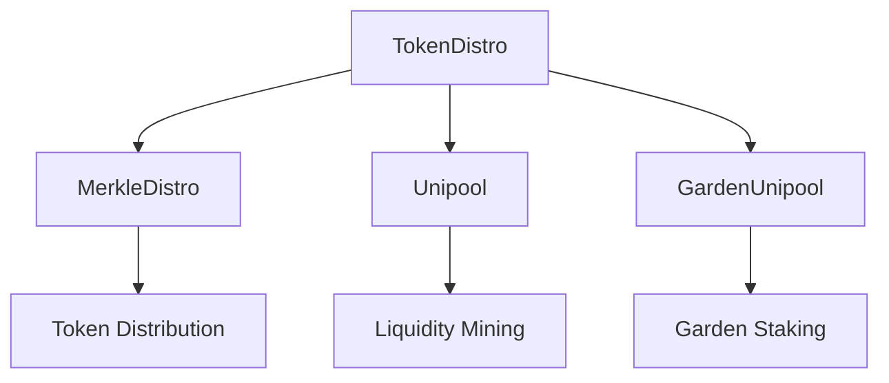

# Giveth Token Contracts

## 1. Project Overview

### Purpose
This repository contains the smart contracts for the Giveth token ecosystem, including token distribution, staking, and liquidity provision mechanisms. It's a core component of the Giveth platform, enabling token distribution and reward mechanisms for the GIV token.

### Key Features
- Token Distribution System
- Merkle Tree-based Airdrop Distribution
- Liquidity Mining Pools
- Staking Mechanisms
- Reward Distribution System

### Live Links
- Mainnet: [Giveth Token](https://etherscan.io/token/0x900db999074d9277c5da2a43f252d74366230da0)
- xDAI: [Giveth Token on xDAI](https://blockscout.com/xdai/mainnet/token/0x4f4F9b8D5B4d0Dc10506e5551B0513B61fD59e75)

## 2. Architecture Overview

### System Diagram


### Tech Stack
- Solidity ^0.7.0
- Hardhat
- TypeScript
- OpenZeppelin Contracts
- Uniswap V3 Integration

### Data Flow
1. Token Distribution:
   - TokenDistro contract manages overall token distribution
   - MerkleDistro handles airdrop distribution
   - Unipool contracts manage liquidity mining rewards

2. Reward Distribution:
   - Distributor scripts handle reward notifications
   - Staking contracts manage user rewards
   - Liquidity pools distribute rewards to providers

## 3. Getting Started

### Prerequisites
- Node.js v14.17.5 or higher
- Yarn package manager
- Git

### Installation Steps
```bash
# Clone the repository
git clone https://github.com/Giveth/giv-token-contracts.git
cd giv-token-contracts

# Install dependencies
yarn install
```

### Configuration
1. Copy `.env.example` to `.env`
2. Configure the following environment variables:
   - `PRIVATE_KEY`: Your deployment wallet private key
   - `INFURA_KEY`: Your Infura API key
   - `ETHERSCAN_API_KEY`: Your Etherscan API key

## 4. Usage Instructions

### Running the Application
```bash
# Compile contracts
yarn compile

# Run tests
yarn test

# Generate merkle tree files
yarn csv2json
yarn generate-merkle-root
```

### Testing
```bash
# Run all tests
yarn test

# Run specific test file
yarn test test/TokenDistro.test.ts
```

### Common Tasks
- Deploy to xDAI:
  ```bash
  yarn deploy:xDAI
  ```
- Deploy to Mainnet:
  ```bash
  yarn deploy:mainnet
  ```
- Deploy to Kovan:
  ```bash
  yarn deploy:kovan
  ```

## 5. Deployment Process

### Environments
- Mainnet
- xDAI
- Kovan (Testnet)
- Local Development

### Deployment Steps
1. Configure network parameters in `hardhat.config.ts`
2. Set gas price and other deployment parameters
3. Run deployment script for target network
4. Verify contracts on block explorer

### CI/CD Integration
- GitHub Actions for automated testing
- Automated contract verification on deployment
- Pre-commit hooks for code formatting

## 6. Troubleshooting

### Common Issues
1. **Compilation Errors**
   - Clear cache: `yarn clear-cache`
   - Check Solidity version compatibility

2. **Deployment Failures**
   - Verify gas price settings
   - Check network connectivity
   - Ensure sufficient funds in deployer account

3. **Test Failures**
   - Clear test cache
   - Check test environment setup
   - Verify test parameters

### Logs and Debugging
- Use Hardhat's built-in console.log
- Check transaction receipts on block explorer
- Monitor gas usage and transaction status

## Install pre-requisites

```
$ npm i
```

## Compile
```
$ npm run compile
```

## Test
```
$ npm run compile
```

## Generate merkle tree files
* Pre-process csv
```
$ npm run csv2json

> hardhat-project@ csv2json /Users/edu/Development/GivethContracts
> ts-node scripts/csv2json.ts ./files/GIV_tokens_-_AIRDROP_TEST_LIST.csv ./files/merkle_distributor_xdai.json

Total distributed tokens: ./files/merkle_distributor_xdai.json amount: 14886637.0
```
* Generate merkle_distributor_result.json
```
$ npm run generate-merkle-root

> generate-merkle-root
> ts-node scripts/csv2json.ts ./files/GIV_tokens_-_AIRDROP_TEST_LIST.csv ./files/merkle_distributor.json

Total distributed tokens: 14430863000000000000000000
```
* Get merkletree root 
```
$ cat ./files/merkle_distributor_xdai_result.json  | jq '.merkleRoot'
"0x05176bac832b5a9cd000091d231638fe0e854801c447aae625ed2f710c026196"
```

## Deploy
**To select the gasPrice you need to edit the hardhat.config.ts**

### xDAI 
```
/Users/amin/.nvm/versions/node/v14.17.5/bin/node /Users/amin/.nvm/versions/node/v14.17.5/lib/node_modules/npm/bin/npm-cli.js run deploy:xDAI --scripts-prepend-node-path=auto

> hardhat-project@ deploy:xDAI /Users/amin/Work/giveth/giv-token-contracts
> HARDHAT_NETWORK=xDAI node deployments/xDAI/1_tokenDistro_merkleDistro_Unipool.js 1635007800 0x5d32A9BaF31A793dBA7275F77856A47A0F5d09b3 0xc81c327f43eC566E14C64AedE5DCf5d9c120D5eb 10000000 0x9Eb16810488760580232fBdd8D3f41994AB0e51D 2500000 7500000 729500000


#######################
##### Deployments #####
#######################
Deployer: 0x5f672d71399d8cDbA64f596394b4f4381247E025
totalTokens: 920000000.0
startTime: 1635007800
cliffPeriod: 0
duration: 11262857
initialPercentage: 1000
tokenAddress: 0x5d32A9BaF31A793dBA7275F77856A47A0F5d09b3
LMDuration: 86400
cancelable: true
merkletree_file: ./files/merkle_distributor_xdai_result.json
merkleTokens: 170500000.0

#######################
##### TokenDistro #####
#######################

deployer: 0x5f672d71399d8cDbA64f596394b4f4381247E025
totalTokens: 920000000.0
startTime: 1635007800
cliffPeriod: 0
duration: 11262857
initialPercentage: 1000
tokenAddress: 0x5d32A9BaF31A793dBA7275F77856A47A0F5d09b3
cancelable: true
########################

TokenDistro deployed to: 0xf11aC05c97F8845f6b974e9e327129d36683cC90

#######################
#####    Check    #####
#######################
TokenDistro - totalTokens: 920000000.0
TokenDistro - startTime: 1635007800
TokenDistro - cliffPeriod: 1635007800
TokenDistro - duration: 11262857
TokenDistro - initialAmount: 92000000000000000000000000
TokenDistro - token: 0x5d32A9BaF31A793dBA7275F77856A47A0F5d09b3
TokenDistro - cancelable: true
This smartcontract needs:  920000000.0 Tokens
token.mint("0xf11aC05c97F8845f6b974e9e327129d36683cC90","920000000000000000000000000")

########################
##### MerkleDistro #####
########################

deployer: 0x5f672d71399d8cDbA64f596394b4f4381247E025
distroAddress: 0xf11aC05c97F8845f6b974e9e327129d36683cC90
merkletree_file: ./files/merkle_distributor_xdai_result.json
#######################

MerkleDistro deployed to: 0x8ECebE69d45d357e5aa2719999B69d7c65003932

#######################

TokenDistro - assign: MerkleDistro 170500000000000000000000000

#######################
#####    Check    #####
#######################
MerkleDistro - _tokenDistro: 0xf11aC05c97F8845f6b974e9e327129d36683cC90
MerkleDistro - _merkleRoot: 0x4fa0be3b7be950dc2a3ad7c9b53d4cc4977255359e7b70ae2f652bc162d2fb0f


######################################################
####### 50GIV/HNY - honeyswap - xDai 10000000 #######
######################################################
deployer: 0x5f672d71399d8cDbA64f596394b4f4381247E025
tokenDistribution: 0xf11aC05c97F8845f6b974e9e327129d36683cC90
uni: 0xc81c327f43eC566E14C64AedE5DCf5d9c120D5eb
duration: 86400
##############################################

GIVHNY_XDAI deployed to: 0x491f1Cc76d619061b833287F493136A2D52BB18e

##############################################

TokenDistro - assign: givhny_xdai 10000000

#######################
#####    Check    #####
#######################
givhny_xdai(tokenDistro,duration,periodFinish,uni):
givhny_xdai - tokenDistro: 0xf11aC05c97F8845f6b974e9e327129d36683cC90
givhny_xdai - duration: 86400
givhny_xdai - periodFinish: 0
givhny_xdai - uni: 0xc81c327f43eC566E14C64AedE5DCf5d9c120D5eb


######################################################
####### 50GIV/WETH - honeyswap - xDai 2500000  #######
######################################################
deployer: 0x5f672d71399d8cDbA64f596394b4f4381247E025
tokenDistribution: 0xf11aC05c97F8845f6b974e9e327129d36683cC90
uni: 0x9Eb16810488760580232fBdd8D3f41994AB0e51D
duration: 86400
##############################################

GIVHNY_XDAI deployed to: 0x00e97BCf2E9A5F6ECF006f89B094255263B16686

##############################################

TokenDistro - assign: givhny_xdai 2500000

#######################
#####    Check    #####
#######################
givweth_xdai(tokenDistro,duration,periodFinish,uni):
givweth_xdai - tokenDistro: 0xf11aC05c97F8845f6b974e9e327129d36683cC90
givweth_xdai - duration: 86400
givweth_xdai - periodFinish: 0
givweth_xdai - uni: 0x9Eb16810488760580232fBdd8D3f41994AB0e51D


######################################################
#######     GIVstaking xDai - xDai - 7500000   #######
######################################################
deployer: 0x5f672d71399d8cDbA64f596394b4f4381247E025
tokenDistribution: 0xf11aC05c97F8845f6b974e9e327129d36683cC90
uni: 0x5d32A9BaF31A793dBA7275F77856A47A0F5d09b3
duration: 86400
##############################################

UNIGIV deployed to: 0x4358c99abFe7A9983B6c96785b8870b5412C5B4B

##############################################

TokenDistro - assign: givhny_xdai 7500000

#######################
#####    Check    #####
#######################
unigiv(tokenDistro,duration,periodFinish,uni):
unigiv - tokenDistro: 0xf11aC05c97F8845f6b974e9e327129d36683cC90
unigiv - duration: 86400
unigiv - periodFinish: 0
unigiv - uni: 0x5d32A9BaF31A793dBA7275F77856A47A0F5d09b3


#######################
#####  Final checks ###
#######################
tokenDistro.balances(tokenDistro.address) allocated: 729500000.0 claimed: 0.0
tokenDistro.balances(merkleDistro.address) allocated: 170500000.0 claimed: 0.0
tokenDistro.balances(givhny_xdai.address) allocated: 10000000.0 claimed: 0.0
tokenDistro.balances(givweth_xdai.address) allocated: 2500000.0 claimed: 0.0
tokenDistro.balances(unigiv.address) allocated: 7500000.0 claimed: 0.0
tokenDistro.hasRole(tokenDistro.DISTRIBUTOR_ROLE(),merkleDistro.address) true
tokenDistro.hasRole(tokenDistro.DISTRIBUTOR_ROLE(),givhny_xdai.address) true
tokenDistro.hasRole(tokenDistro.DISTRIBUTOR_ROLE(),givweth_xdai.address) true
tokenDistro.hasRole(tokenDistro.DISTRIBUTOR_ROLE(),unigiv.address) true
```

### Mainnet (Kovan)
```
/Users/amin/.nvm/versions/node/v14.17.5/bin/node /Users/amin/.nvm/versions/node/v14.17.5/lib/node_modules/npm/bin/npm-cli.js run deploy:kovan --scripts-prepend-node-path=auto

> hardhat-project@ deploy:kovan /Users/amin/Work/giveth/giv-token-contracts
> HARDHAT_NETWORK=kovan node deployments/mainnet/2_tokenDistro_Unipools.js 1635007800 0x03472537CB64652Aa1224E4aaF6f33a34e73E877 0x487195072fB88ddE7DDA2Ef1A688C6380b995478 10000000 0x1ee71e1ed744ae6d4058f5c7797c2e583dbfb095 2500000 2500000


#######################
##### Deployments #####
#######################
Deployer: 0x5f672d71399d8cDbA64f596394b4f4381247E025
totalTokens: 15000000.0
startTime: 1635007800
cliffPeriod: 0
duration: 11262857
initialPercentage: 1000
tokenAddress: 0x03472537CB64652Aa1224E4aaF6f33a34e73E877
LMDuration: 43200
cancelable: false

#######################
##### TokenDistro #####
#######################

deployer: 0x5f672d71399d8cDbA64f596394b4f4381247E025
totalTokens: 15000000.0
startTime: 1635007800
cliffPeriod: 0
duration: 11262857
initialPercentage: 1000
tokenAddress: 0x03472537CB64652Aa1224E4aaF6f33a34e73E877
cancelable: false
########################

TokenDistro deployed to: 0x60A936F085403160864653B7d0d2c3bc133d18D0

#######################
#####    Check    #####
#######################
TokenDistro - totalTokens: 15000000.0
TokenDistro - startTime: 1635007800
TokenDistro - cliffPeriod: 1635007800
TokenDistro - duration: 11262857
TokenDistro - initialAmount: 1500000000000000000000000
TokenDistro - token: 0x03472537CB64652Aa1224E4aaF6f33a34e73E877
TokenDistro - cancelable:
false This smart-contract needs:  15000000.0 Tokens
token.mint("0x60A936F085403160864653B7d0d2c3bc133d18D0","15000000000000000000000000")

######################################################
#######   50GIV/ETH - Uni  Mainnet 10000000   #######
######################################################
deployer: 0x5f672d71399d8cDbA64f596394b4f4381247E025
tokenDistribution: 0x60A936F085403160864653B7d0d2c3bc133d18D0
uni staker: 0x1f98407aaB862CdDeF78Ed252D6f557aA5b0f00d
duration: 43200
##############################################

GIVETH_UNI_REWARD deployed to: 0x6b66368EddB78E61179523cf21049af40f797F4E

##############################################

UniswapV3RewardToken - mint: GIVETH_UNI_STAKER 10000000
TokenDistro - assign: giveth_uni_reward 10000000
The new incentiveId will be 0x550595f7254e7d91d5e063bf0a09cabe6632ab716e56bc9962905ca659e6c1f2
Checking if deployer (0x5f672d71399d8cDbA64f596394b4f4381247E025) has enough rewards token balance...
Balance 10000000.0 (10000000000000000000000000) is sufficient.
Checking if deployer (0x5f672d71399d8cDbA64f596394b4f4381247E025) has approved staker contract to spend the reward...
Missing 10000000000000000000000000 allowance. Setting up allowance...
Creating approve() tx 0x02dcfc046e3e496f22ecf7bc36fe8888c8d3543eef3d1c75a8bf4d71e7ae2308...
Tx 0x02dcfc046e3e496f22ecf7bc36fe8888c8d3543eef3d1c75a8bf4d71e7ae2308 confirmed!


Key:  {
  startTime: '1635007800',
  endTime: '1646270657',
  pool: '0x487195072fB88ddE7DDA2Ef1A688C6380b995478',
  rewardToken: '0x6b66368EddB78E61179523cf21049af40f797F4E',
  refundee: '0x5f672d71399d8cDbA64f596394b4f4381247E025'
}


Creating incentive in tx 0xc6dbc2bd743dce7b86e297b218ad843818b3373e79e4bae8df00d7690a899421...

#######################
#####    Check    #####
#######################
giveth_uni_reward(tokenDistro,duration,periodFinish,uni):
giveth_uni_reward - tokenDistro: 0x60A936F085403160864653B7d0d2c3bc133d18D0

uniswap v3 staker - balance of giveth_uni_reward: 10000000.0


######################################################
####### 80GIV/ETH - Bal   Mainnet   2500000  #######
######################################################
deployer: 0x5f672d71399d8cDbA64f596394b4f4381247E025
tokenDistribution: 0x60A936F085403160864653B7d0d2c3bc133d18D0
uni: 0x1eE71e1Ed744AE6D4058F5c7797C2e583DbfB095
duration: 43200
##############################################

GIVETH_BAL deployed to: 0x087Cbc387b8746A73E3EbA9A31782F5ee7B6cC45

##############################################

TokenDistro - assign: giveth_uni_reward 2500000

#######################
#####    Check    #####
#######################
giveth_bal(tokenDistro,duration,periodFinish,uni):
giveth_bal - tokenDistro: 0x60A936F085403160864653B7d0d2c3bc133d18D0
giveth_bal - duration: 43200
giveth_bal - periodFinish: 0
giveth_bal - uni: 0x1eE71e1Ed744AE6D4058F5c7797C2e583DbfB095


######################################################
#######   GIVstaking ETH    Mainnet    2500000   #######
######################################################
deployer: 0x5f672d71399d8cDbA64f596394b4f4381247E025
tokenDistribution: 0x60A936F085403160864653B7d0d2c3bc133d18D0
uni: 0x03472537CB64652Aa1224E4aaF6f33a34e73E877
duration: 43200
##############################################

UNIGIV deployed to: 0x8d74ee0C611fA62210B66e051f31A0c103b6eDD6

##############################################

TokenDistro - assign: giveth_uni_reward 2500000

#######################
#####    Check    #####
#######################
unigiv(tokenDistro,duration,periodFinish,uni):
unigiv - tokenDistro: 0x60A936F085403160864653B7d0d2c3bc133d18D0
unigiv - duration: 43200
unigiv - periodFinish: 0
unigiv - uni: 0x03472537CB64652Aa1224E4aaF6f33a34e73E877


#######################
#####  Final checks ###
#######################
tokenDistro.balances(tokenDistro.address) allocated: 0.0 claimed: 0.0
tokenDistro.balances(giveth_uni_reward.address) allocated: 10000000.0 claimed: 0.0
tokenDistro.balances(giveth_bal.address) allocated: 2500000.0 claimed: 0.0
tokenDistro.balances(unigiv.address) allocated: 2500000.0 claimed: 0.0
tokenDistro.hasRole(tokenDistro.DISTRIBUTOR_ROLE(),giveth_uni_reward.address) true
tokenDistro.hasRole(tokenDistro.DISTRIBUTOR_ROLE(),giveth_bal.address) true
tokenDistro.hasRole(tokenDistro.DISTRIBUTOR_ROLE(),unigiv.address) true
```
